# URL Shortener System Design
> **Interview Format:** 45-minute FAANG system design loop  
> **Difficulty:** L5/L6 (Senior / Staff)  
> **Comparable Systems:** bit.ly, TinyURL, t.co

---

## Table of Contents

1. [Problem Framing — Start Here](#1-problem-framing--start-here)
2. [Back-of-the-Envelope Estimation](#2-back-of-the-envelope-estimation)
3. [API Contract](#3-api-contract)
4. [High-Level Architecture](#4-high-level-architecture)
5. [Deep Dive 1 — Key Generation](#5-deep-dive-1--key-generation)
6. [Deep Dive 2 — Database Schema & Indexing](#6-deep-dive-2--database-schema--indexing)
7. [Deep Dive 3 — Global Replication & Consistency](#7-deep-dive-3--global-replication--consistency)
8. [Deep Dive 4 — Analytics & Metrics Pipeline](#8-deep-dive-4--analytics--metrics-pipeline)
9. [Failure Modes & Edge Cases](#9-failure-modes--edge-cases)
10. [Interview Playbook](#10-interview-playbook)

---

## 1. Problem Framing — Start Here

> **Interviewer tip:** Never jump to diagrams before this section. Meta interviewers grade heavily on *how you clarify requirements*. Spend 3–5 minutes here.

### What problem are we actually solving?

A URL shortener solves two problems:
- **Space:** Long URLs break in SMS, tweets, printed materials.
- **Indirection:** The short URL is a *pointer*, letting us track clicks, expire links, and A/B test destinations — all *without changing the printed URL*.

This indirection is the system's core value proposition. Every design decision flows from it.

### Functional Requirements (confirm with interviewer)

| # | Requirement | Notes |
|---|-------------|-------|
| FR1 | Given a long URL, generate a short URL | Core feature |
| FR2 | Given a short URL, redirect to original | The hot path (100:1 read/write) |
| FR3 | Links expire after a configurable TTL | Default: 2 years |
| FR4 | Users can request a custom alias | e.g. `bit.ly/my-sale` |
| FR5 | Analytics: click counts, geo, referrer | Async, eventual consistency is fine |

### Non-Functional Requirements

| # | Requirement | Target | Why |
|---|-------------|--------|-----|
| NFR1 | Redirect latency (p99) | < 50ms | UX — users notice redirect lag |
| NFR2 | Write latency (p99) | < 200ms | Background operation |
| NFR3 | Availability | 99.99% | 52 min downtime/year |
| NFR4 | Durability | 99.999% | Never lose a mapping |
| NFR5 | Short key uniqueness | Guaranteed | Collision = broken link |
| NFR6 | Scale | 500M writes/month, 50B reads/month | 100:1 ratio |

### What we are NOT building (scope boundary)

- User authentication / OAuth
- Payment / subscription tiers
- QR code generation
- Browser extension

---

## 2. Back-of-the-Envelope Estimation

> **First-principles approach:** Derive everything from the 500M write/month number. Do not memorise — show the reasoning.

### Write Traffic

```
500M writes/month
= 500M / (30 days × 24h × 3600s)
= 500,000,000 / 2,592,000
≈ 193 writes/sec  →  round to 200 writes/sec
```

### Read Traffic (100:1 ratio)

```
100 × 200 = 20,000 reads/sec  →  20K RPS
```

### Storage

```
Per record:
  original_url   : 256 chars  = 512 bytes
  short_key      : 7 chars    = 14 bytes
  user_id        : 8 bytes
  created_at     : 8 bytes
  expires_at     : 8 bytes
  ─────────────────────────────
  Total raw      ≈ 550 bytes
  With index + overhead ≈ 1 KB

5-year horizon:
  200 writes/sec × 86,400 sec/day × 365 days × 5 years
  = 200 × 31,536,000 × 5
  = 31.5 billion records

Total storage:
  31.5B × 1 KB = 31.5 TB raw
  × 3 replicas = ~95 TB
```

### Cache Sizing

```
Apply Zipf's law: top 20% of URLs absorb 80% of reads.

Daily read volume:
  20,000 RPS × 86,400 sec = 1.73 billion reads/day

Hot set (20%):
  0.20 × 1.73B = 346M reads/day from hot URLs

Records to cache (unique hot URLs):
  Assume 20% of 500M monthly writes = 100M URLs
  100M × 1 KB = 100 GB Redis cluster

Practical: use 128 GB Redis cluster with LRU eviction
```

### Key Space

```
Base-62 alphabet: 0-9, a-z, A-Z  →  62 symbols

62^7 = 3.52 trillion unique keys
62^6 =  56.8 billion unique keys

At 200 writes/sec: 3.52T / 200 = 557 years of runway with 7-char keys
→  7 chars is the sweet spot
```

---

## 3. API Contract

### Shorten URL

```http
POST /v1/urls
Content-Type: application/json
Authorization: Bearer {api_key}

{
  "long_url":   "https://www.example.com/very/long/path?query=value",
  "custom_key": "my-sale",        // optional
  "ttl_days":   365               // optional, default 730
}
```

**Response 201 Created:**
```json
{
  "short_url":  "https://sho.rt/3DKusUK",
  "short_key":  "3DKusUK",
  "long_url":   "https://www.example.com/very/long/path?query=value",
  "expires_at": "2027-03-16T00:00:00Z",
  "created_at": "2026-03-16T10:00:00Z"
}
```

**Error responses:**
- `400` — malformed URL or invalid custom key characters  
- `409` — custom key already taken  
- `422` — shortened URL passed as input (circular reference prevention)  
- `429` — rate limit exceeded

### Redirect

```http
GET /{short_key}
```

**Response:**
- `302 Found` with `Location: {long_url}` header ← **preferred** (explained below)
- `404 Not Found` — key doesn't exist
- `410 Gone` — key existed but is expired

> **Why 302 (Found) not 301 (Moved Permanently)?**
>
> `301` is cached by browsers permanently — the redirect never hits your servers again.
> This breaks click analytics, A/B testing, and destination updates.
> `302` (temporary redirect) forces the browser to re-check every time, so every click is observable.
> Bit.ly uses `301` for their free tier and `302` for paid (analytics) tier — a deliberate product decision.

### Get Analytics

```http
GET /v1/urls/{short_key}/analytics?from=2026-01-01&to=2026-03-16&granularity=day
Authorization: Bearer {api_key}
```

### Delete / Expire URL

```http
DELETE /v1/urls/{short_key}
Authorization: Bearer {api_key}
```

---

## 4. High-Level Architecture

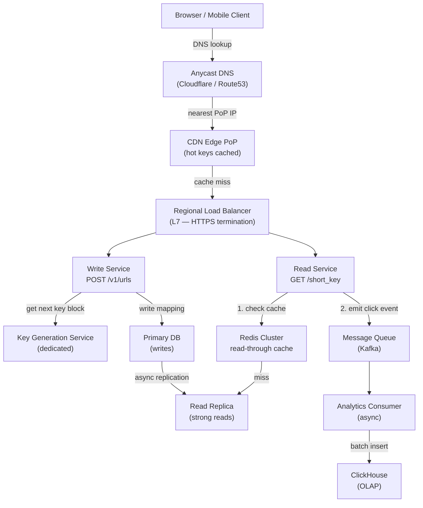

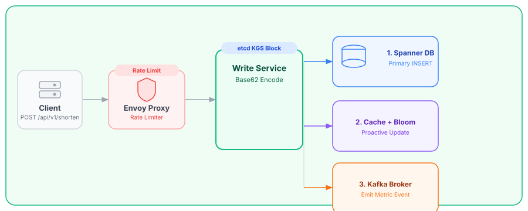

### Request flow — Write path

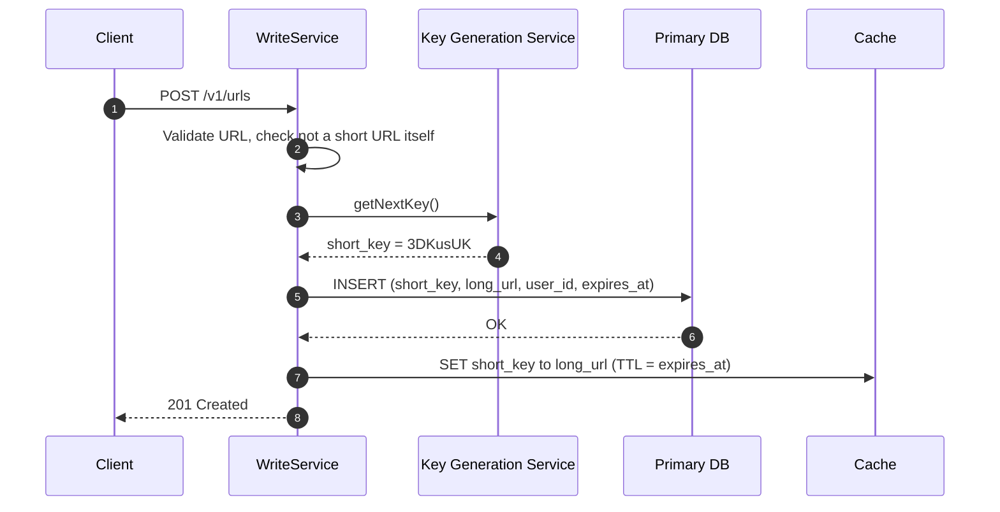

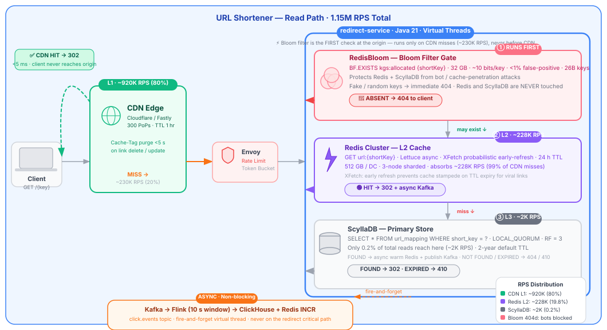

### Request flow — Read path (hot)

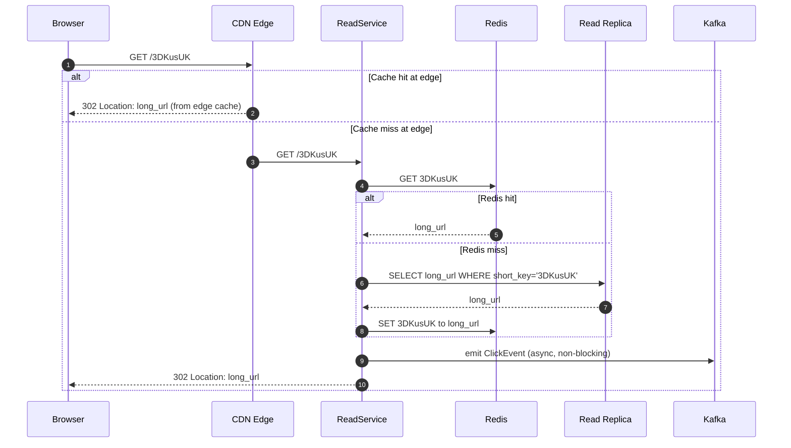

---

## 5. Deep Dive 1 — Key Generation

> The core algorithmic problem. There are two canonical approaches. Interviewers expect you to reason through the trade-offs, not just pick one.

### The Fundamental Tension

We need keys that are:
- **Unique** — no two URLs can have the same key
- **Short** — 7 characters maximum
- **Fast to generate** — must not be on the write critical path
- **Unpredictable** — cannot be enumerated by attackers

These goals conflict. Here's how each approach handles them:

---

### Approach A — Hash-Based (MD5 / SHA-256 + Base62)

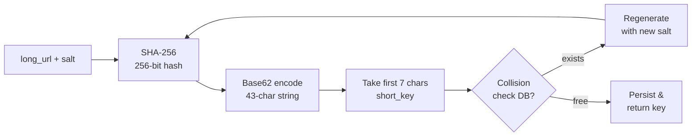

**Why SHA-256 + Base62, not MD5 + hex?**

| Property | MD5 + hex | SHA-256 + Base62 |
|----------|-----------|------------------|
| Output length | 32 hex chars | 43 Base62 chars |
| Collision resistance | Weak (MD5 broken) | Strong |
| Alphabet size | 16 | 62 |
| 7-char keyspace | 16^7 = 268M | 62^7 = 3.52T |

Taking first 7 chars of a 43-char Base62 string is **not** the same as hashing to 7 chars — it preserves much more of the hash's entropy.

**The collision problem:**

```
P(collision after k insertions) ≈ k² / (2N)

With N = 62^7 = 3.52 trillion, k = 31.5 billion (5-year writes):
P ≈ (31.5B)² / (2 × 3.52T)
  = 9.92 × 10^20 / 7.04 × 10^12
  ≈ 1.4 × 10^8   →  effectively certain at this scale
```

**Conclusion:** Hash-based approach requires collision detection via a DB round-trip on every write. At 200 writes/sec this is manageable, but the DB lookup adds ~5ms latency and creates a contention point.

---

### Approach B — Counter-Based with Block Allocation ✅ Preferred

**Core insight:** Instead of generating a random key and checking for uniqueness, *pre-allocate exclusive numeric ranges* and convert them to Base62. Uniqueness is guaranteed by range exclusivity — no DB lookup needed at write time.

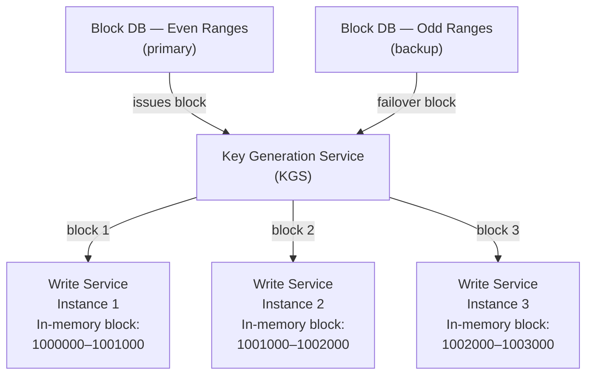

**How it works, step by step:**

1. **Two block databases** (odd ranges + even ranges) — for fault tolerance. If one dies, the other covers 100% of new key issuance (unlike the original article's flawed 50% characterization — with *alternating* blocks, both can serve *all* new requests, each from its own range).

2. **Write Service starts up:** Requests a block of 1,000 sequential integers from KGS.
   - Stores block in memory: `{start: 1000000, end: 1001000, current: 1000000}`
   - No DB call needed until the block is exhausted

3. **Per request:** `current++` → convert to Base62 → this is the `short_key`.

4. **Block exhausted:** Request next block from KGS (async, pre-fetch when 80% used).

**Base-62 counter conversion:**

```
Decimal  →  Base62
1000000  →  "1000000"  (7 chars, starting point)
1000001  →  "1000001"
...
182619516112  →  "3DKusUK"
182619516113  →  "3DKusUL"
```

Key insight: monotonically increasing decimal integers map to monotonically increasing Base62 strings of fixed length once you're in the right range (`1000000` in Base62 = `56 billion` in decimal — we never exceed `ZZZZZZZ` = `3.52 trillion` in decimal).

**Preventing hotspot writes (monotonic key problem):**

A monotonically increasing primary key causes all DB writes to go to the *last page* of the B-tree index — a classic write hotspot.

Solutions (ranked by elegance):

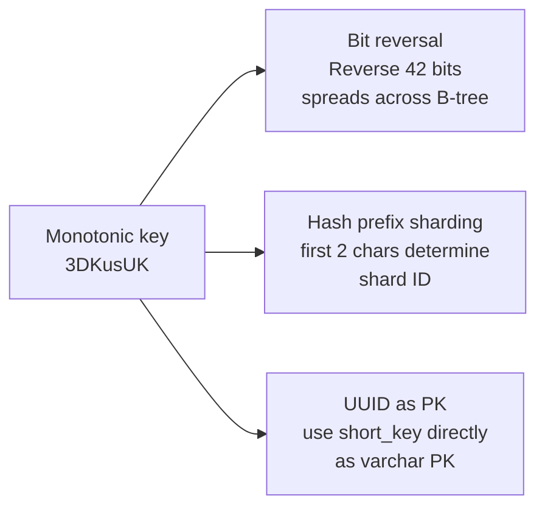

**Bit reversal** is the most CPU-efficient: flip the binary representation of the integer counter before storing as PK. Adjacent counters map to opposite ends of the keyspace → writes spread across the whole B-tree.

**Comparison table:**

| Property | Hash-Based | Counter-Based |
|----------|-----------|---------------|
| Uniqueness guarantee | Probabilistic (needs DB check) | Absolute (range exclusivity) |
| Write latency | +5ms (DB collision check) | O(1) in-memory |
| Key predictability | Unpredictable ✓ | Sequential (enumerate-able) ✗ |
| Custom key support | Natural | Needs separate alias table |
| Block waste on crash | None | ~1,000 keys (1 block) |
| Fault tolerance | DB replication | Dual block DBs |

**Recommendation for interview:** Use Counter-Based as the primary design, Hash-Based for custom alias support (hybrid). Address key predictability by saying: "short keys are not secret — knowing `3DKusUL` exists doesn't give you the content of `3DKusUK`. If the content at the URL is sensitive, that's the origin server's problem (auth)."

---

### Custom Aliases — Hybrid Approach

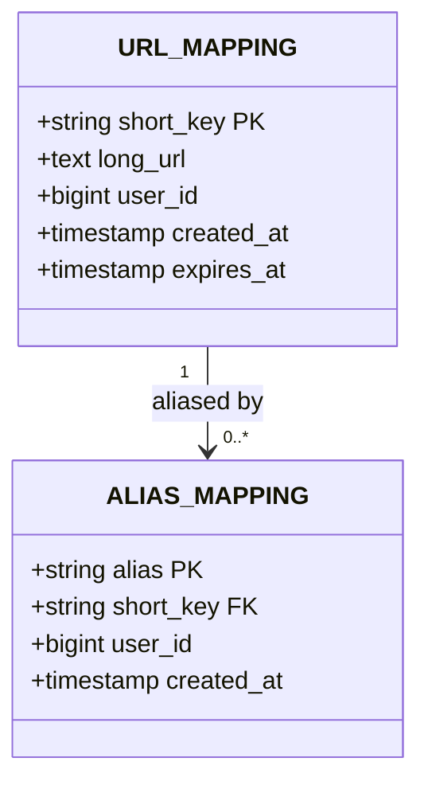

On lookup: check `ALIAS_MAPPING` first → resolve to `short_key` → lookup `URL_MAPPING`. Two reads, but alias lookups can be cached identically to regular keys.

---

## 6. Deep Dive 2 — Database Schema & Indexing

### Schema Design

```sql
-- Core mapping table
CREATE TABLE url_mapping (
    short_key     CHAR(7)      NOT NULL,
    long_url      TEXT         NOT NULL,          -- up to 2048 chars
    user_id       BIGINT,                          -- nullable (anonymous)
    created_at    TIMESTAMPTZ  NOT NULL DEFAULT now(),
    expires_at    TIMESTAMPTZ,                     -- NULL = never expires
    is_active     BOOLEAN      NOT NULL DEFAULT true,
    click_count   BIGINT       NOT NULL DEFAULT 0, -- approximate, async updated

    PRIMARY KEY (short_key)
);

-- Index for user's URL management dashboard
CREATE INDEX idx_url_mapping_user_id
    ON url_mapping (user_id, created_at DESC)
    WHERE user_id IS NOT NULL;

-- Index for expiry cleanup job
CREATE INDEX idx_url_mapping_expires
    ON url_mapping (expires_at)
    WHERE expires_at IS NOT NULL AND is_active = true;

-- Custom alias table
CREATE TABLE alias_mapping (
    alias         VARCHAR(50)  NOT NULL,
    short_key     CHAR(7)      NOT NULL REFERENCES url_mapping(short_key),
    user_id       BIGINT       NOT NULL,
    created_at    TIMESTAMPTZ  NOT NULL DEFAULT now(),

    PRIMARY KEY (alias)
);

-- Rate limit tracking (can also live in Redis)
CREATE TABLE api_key_quota (
    api_key       VARCHAR(64)  NOT NULL,
    window_start  TIMESTAMPTZ  NOT NULL,
    write_count   INT          NOT NULL DEFAULT 0,
    read_count    INT          NOT NULL DEFAULT 0,

    PRIMARY KEY (api_key, window_start)
);
```

### Why these indexes and not others?

**PRIMARY KEY (short_key):** The redirect path (hot path at 20K RPS) is a pure primary key lookup. This must be O(log n) B-tree or O(1) hash index. No secondary index needed.

**idx_url_mapping_user_id:** Only needed for the "my links" dashboard — a secondary, low-traffic path. The `WHERE user_id IS NOT NULL` partial index saves ~20% space (anonymous clicks are the majority).

**idx_url_mapping_expires:** Used exclusively by the expiry cleanup cron job (`DELETE WHERE expires_at < now()`). A partial index on only active, expiring rows is much smaller and faster than a full index.

**No index on long_url:** You might think "what if two users submit the same long URL — should we deduplicate?" Don't. Deduplication requires a full-table scan or an index on a TEXT column (expensive). The cost of storing two rows for the same URL is negligible (~1 KB). The complexity of deduplication (race conditions, cross-user privacy) far outweighs the benefit.

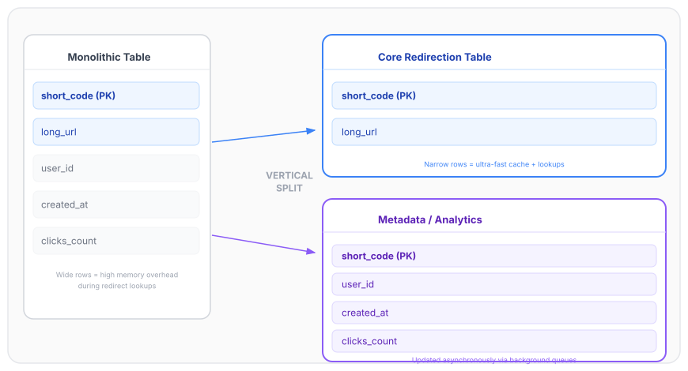

### Sharding Strategy

At 31.5 TB over 5 years, a single PostgreSQL instance won't cut it. Options:

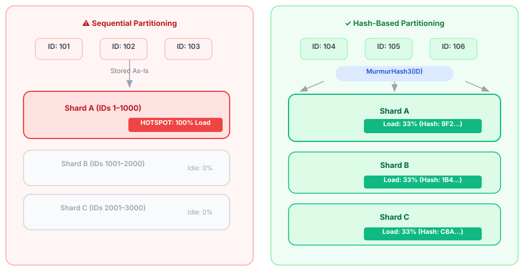

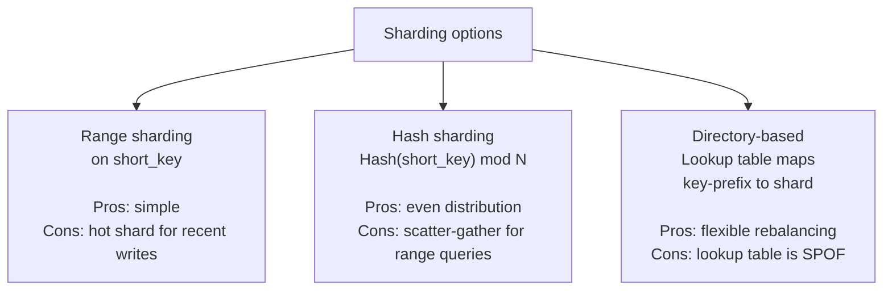

**Recommended:** Hash sharding on `short_key` with consistent hashing (virtual nodes). The redirect path only ever looks up by `short_key` — no range queries needed. Even distribution is more valuable than range locality.

```
shard_id = hash(short_key) mod num_shards

With 300 shards × 100 GB each = 30 TB capacity
Each shard: primary + 2 read replicas = 900 total nodes
```

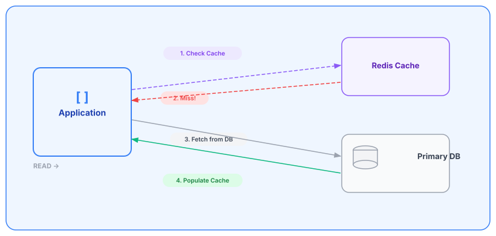

### Caching Layer Design

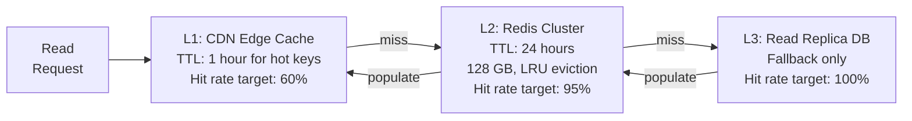

**Cache invalidation on expiry:**

Don't rely on TTL alone — use a lazy expiry check:
1. Cache stores `{long_url, expires_at}` as the value.
2. Read Service checks `expires_at` after cache hit.
3. If expired: return `410 Gone`, delete from cache, soft-delete in DB.
4. Background job cleans up DB records older than 30 days post-expiry.

**Cache stampede prevention:**

When a viral link is first shared, thousands of requests arrive simultaneously for an uncached key. All miss the cache and hammer the DB.

Solution: **probabilistic early expiration** (XFetch algorithm):
```python
# On cache read:
if (ttl - current_time) < beta * delta * random():
    # Proactively refresh before expiry
    refresh_from_db(key)
```
This probabilistically refreshes hot keys slightly early, eliminating the thundering herd.

---

## 7. Deep Dive 3 — Global Replication & Consistency

### CAP Theorem Position

For the **redirect path**, choose **AP (Availability + Partition Tolerance)**:
- A stale redirect (serving yesterday's destination) is better than a `503` error.
- Eventual consistency is acceptable for URL mappings — they almost never change.

For the **write path**, choose **CP (Consistency + Partition Tolerance)**:
- Duplicate key issuance (two records with same `short_key`) is catastrophic.
- We can tolerate write failures; we cannot tolerate write inconsistencies.

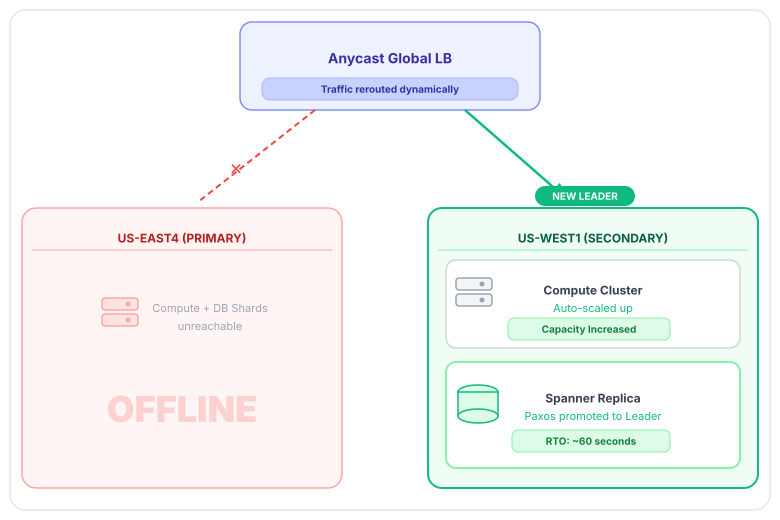

### Multi-Region Architecture

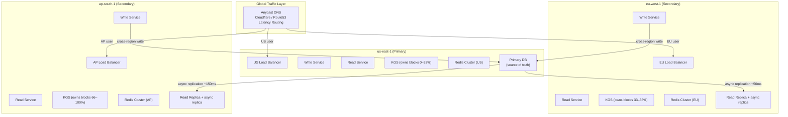

### Write Path — Why Route Writes to a Single Primary?

This is the key interview insight. **Why not write locally in each region?**

Multi-master writes (e.g., CRDTs, Dynamo-style) introduce:
1. **Conflict resolution complexity** — two regions could independently issue the same `short_key` (if KGS coordination fails).
2. **Replication lag** — during a partition, a key written in EU might not be visible in US for 50ms+, causing `404` responses for freshly created links.

**Decision:** All writes route to the nearest region that owns the KGS block range for that request. Each region's KGS owns a disjoint partition of the total key space — no cross-region coordination needed for key uniqueness.

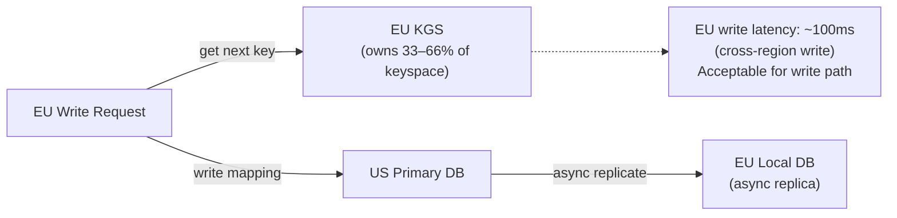

### Read Path — Local Reads

Reads never cross regions. A user in Mumbai reads from the `ap-south-1` replica:

- **Replication lag risk:** A link created < 150ms ago might not be on the AP replica yet.
- **Mitigation:** After creating a short link, the API response includes the short URL. The user immediately clicking it is an extremely rare case (< 0.01%). When it does happen, serve a user-friendly "link is being propagated, please retry in a moment" page rather than a hard 404.

### Consistency Levels (by operation type)

| Operation | Consistency | Reason |
|-----------|-------------|--------|
| Create short URL | Strong | Must not issue duplicate keys |
| Redirect lookup | Eventual | Stale redirect > 503 error |
| Delete / expire URL | Strong | Must not redirect to deleted content |
| Read analytics | Eventual | Dashboard data can be seconds old |
| Custom alias write | Strong | Conflict = broken user experience |

### Active-Active vs Active-Passive

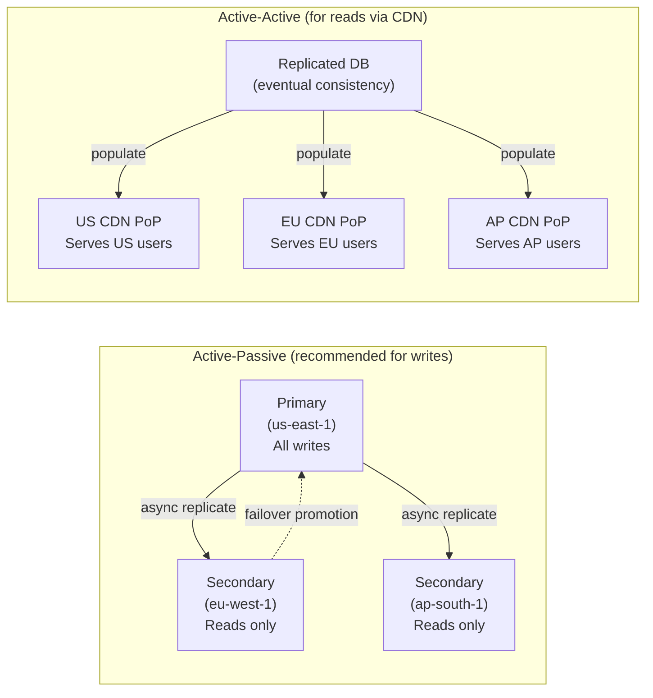

**Failover procedure (primary region down):**

1. Route53 health check detects `us-east-1` unhealthy after 30s.
2. DNS failover promotes `eu-west-1` to primary.
3. `eu-west-1` KGS takes over entire key block space.
4. RTO: ~60 seconds. RPO: ~50ms of writes potentially lost.

To reduce RPO to zero: use **synchronous replication** to one standby (at the cost of +50ms write latency).

---

## 8. Deep Dive 4 — Analytics & Metrics Pipeline

### Why a separate analytics pipeline?

The redirect path must return a `302` in under 50ms. If analytics were synchronous (write to DB on every click), the click-tracking DB write would be on the critical path. At 20K RPS, that's 20,000 writes/sec to the analytics DB — and any analytics DB latency spikes would degrade the user-visible redirect latency.

**Solution:** Emit a fire-and-forget Kafka event on every click. The redirect completes immediately; analytics processing is fully decoupled.

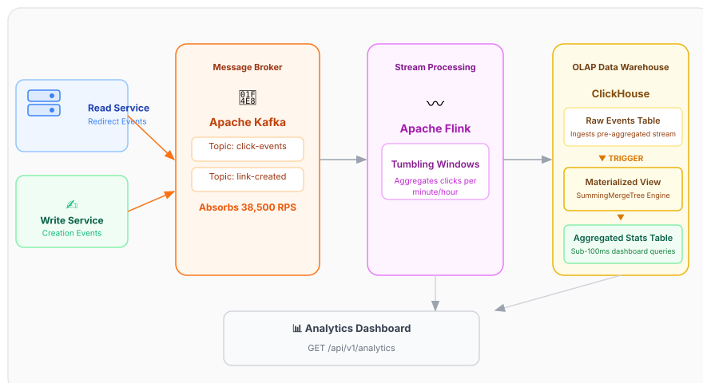

### Pipeline Architecture

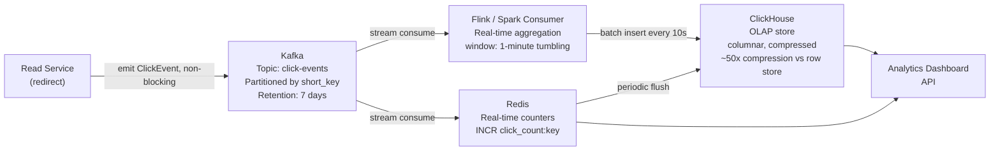

### Click Event Schema

```json
{
  "event_id":   "01HXYZ...",          // ULID — time-sortable, unique
  "short_key":  "3DKusUK",
  "timestamp":  "2026-03-16T10:23:44.123Z",
  "ip_hash":    "sha256(ip + daily_salt)",  // never store raw IP (GDPR)
  "country":    "IN",                  // resolved from IP at edge
  "region":     "KA",
  "city":       "Bengaluru",
  "referrer":   "https://twitter.com",
  "user_agent": "Mozilla/5.0...",
  "device":     "mobile",              // parsed from user_agent
  "browser":    "Chrome/120",
  "os":         "Android/14"
}
```

### ClickHouse Schema (Columnar OLAP)

```sql
CREATE TABLE click_events (
    short_key   LowCardinality(String),   -- optimized for repeated values
    event_time  DateTime,
    country     LowCardinality(String),
    city        String,
    referrer    String,
    device      LowCardinality(String),
    browser     LowCardinality(String)
)
ENGINE = MergeTree()
PARTITION BY toYYYYMM(event_time)          -- monthly partitions for pruning
ORDER BY (short_key, event_time)           -- primary sort key
SETTINGS index_granularity = 8192;

-- Pre-aggregated materialized view for dashboard queries
CREATE MATERIALIZED VIEW click_hourly_mv
ENGINE = SummingMergeTree()
PARTITION BY toYYYYMM(hour)
ORDER BY (short_key, hour, country, device)
AS SELECT
    short_key,
    toStartOfHour(event_time) AS hour,
    country,
    device,
    count() AS clicks
FROM click_events
GROUP BY short_key, hour, country, device;
```

**Why ClickHouse over PostgreSQL for analytics?**

| Query | PostgreSQL (row) | ClickHouse (column) |
|-------|-----------------|---------------------|
| `SELECT count(*) WHERE short_key='3DK...'` | Scans full row (1KB each) | Reads only `short_key` column (14 bytes each) |
| Compression ratio | ~2x | ~50x (columnar delta encoding) |
| Aggregation speed (1B rows) | Minutes | Seconds |
| Write throughput | ~50K rows/sec | ~1M rows/sec (batch) |

### Real-time Counters vs Batch Analytics

Two different data paths for two different use cases:

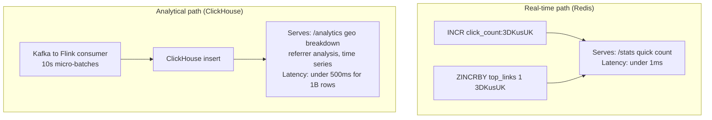

**GDPR / Privacy note** (mention this — Meta cares deeply):
- Never store raw IP addresses. Hash with a daily-rotating salt: `sha256(ip + date_salt)`.
- This allows "unique visitor" counting within a day without persistent tracking.
- Country/city resolution happens at the CDN edge (Cloudflare Workers) before the IP leaves the PoP — raw IP never reaches your origin.

---

## 9. Failure Modes & Edge Cases

### Failure Mode Matrix

| Failure | Impact | Detection | Mitigation |
|---------|--------|-----------|------------|
| Write Service crash | New URL creation fails | Health check + LB drain | Stateless — restart, KGS block returned |
| Read Service crash | Redirects fail | Health check, 99.99% SLA alert | Stateless — restart immediately |
| KGS crash | Write Service can't get new blocks | Write Service timeout | Dual KGS (odd/even), circuit breaker falls back |
| Redis crash | Every read hits DB | Redis sentinel / cluster health | DB read replicas absorb load; Redis auto-restart |
| Primary DB crash | Writes fail | Replication lag alert | Failover to replica (60s RTO), writes queue in Kafka |
| Kafka lag spike | Analytics delayed | Consumer lag metric > 1M events | Scale consumers, shed non-critical metrics |
| CDN cache poisoning | Stale or wrong redirects served | Anomaly detection on 302 count drop | Short CDN TTL (1hr), purge API on URL update |

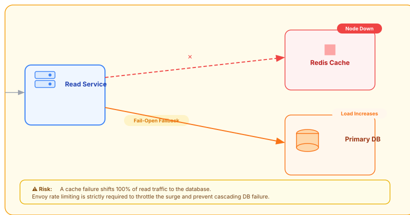

### Edge Cases

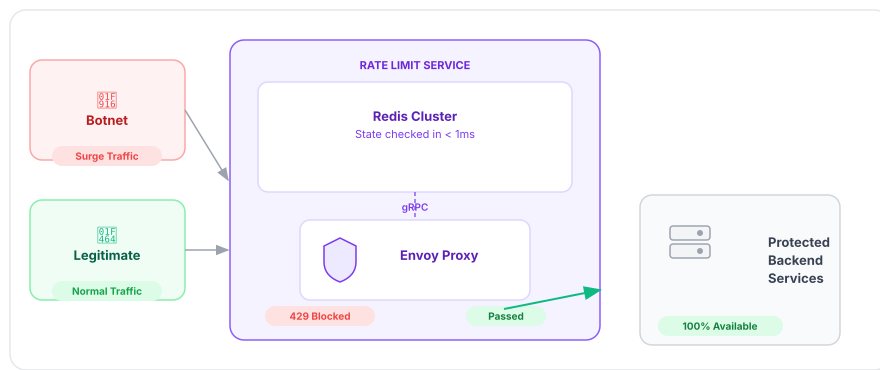

**Circular redirect prevention:**
```python
def validate_url(url: str) -> bool:
    parsed = urlparse(url)
    # Reject if hostname matches our own domain
    if parsed.hostname in OUR_DOMAINS:
        raise CircularRedirectError("Cannot shorten a short URL")
    return True
```

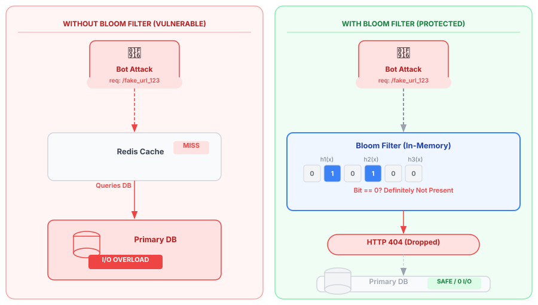

**Malicious URL detection:**
- Check `long_url` against Google Safe Browsing API on write.
- Async scan — don't block the write. If flagged, set `is_active = false` and serve a warning interstitial instead of redirecting.

**Custom key conflicts with counter range:**
```
Counter key space: "1000000" to "ZZZZZZZ" (all 7-char Base62)
Custom keys: stored in alias_mapping table — separate namespace
No collision possible by design
```

**Same long URL, multiple short keys:**
This is fine and by design. Counter-based approach generates a new key per request. Benefits:
- Each key independently trackable.
- One key can be shared with group A, another with group B for A/B testing.
- Removing one key doesn't affect others.

**Expired key reuse:**
Do NOT reuse expired keys. A web crawler or user's bookmarks may have cached the old mapping. Serving a different URL under the same key is confusing and potentially a phishing vector. Keys are retired permanently.

---

## 10. Interview Playbook

### 45-Minute Time Budget

```
0:00 – 5:00   Requirements clarification (FR, NFR, scope boundary)
5:00 – 10:00  Back-of-envelope (write it on the whiteboard, show your math)
10:00 – 15:00 API design (POST /v1/urls, GET /{key}, 302 vs 301 discussion)
15:00 – 25:00 High-level architecture + sequence diagrams
25:00 – 35:00 Deep dives (interviewer will pick 1–2 of the 4 areas)
35:00 – 42:00 Failure modes & trade-off discussion
42:00 – 45:00 Wrap-up, questions for interviewer
```

### The 3 Questions Every Meta Interviewer Will Ask

**1. "Why 302 not 301?"**
> "301 is permanently cached by the browser — the redirect never hits our servers again, breaking all analytics. We need 302 because indirection is the whole value proposition — every click must be observable. I'd only use 301 if we had a 'performance mode' where analytics don't matter and we want CDN-level caching."

**2. "What's your biggest bottleneck at 100x scale?"**
> "The Redis cluster for reads and the primary DB for writes. At 100x (2M RPS reads), I'd move to a tiered cache: L1 at CDN edge handles 80% of traffic for viral links, L2 Redis handles 95% of cache misses, and only 0.25% of reads hit the DB. For writes (20K/sec), I'd shard the DB on `short_key` hash with consistent hashing across 100+ shards and scale the KGS block allocation to match."

**3. "How do you handle a region going down?"**
> "For reads: CDN and Redis serve from local cache — completely unaffected. For writes: Route53 health checks detect failure in ~30 seconds and fail over DNS to the next region's KGS. That region takes over the full key block space. RPO is the last ~30 seconds of writes. If we need zero RPO, we add synchronous replication to one standby at the cost of +50ms write latency — a business decision."

### Trade-offs to Proactively Volunteer

These show depth — mention them before the interviewer asks:

| Trade-off | Your position |
|-----------|---------------|
| Hash-based vs counter-based keys | Counter-based for performance; hash-based for custom alias support (hybrid) |
| 302 vs 301 | 302 always unless analytics are explicitly not needed |
| Strong vs eventual consistency | Strong for writes (key uniqueness), eventual for reads (availability) |
| ClickHouse vs PostgreSQL for analytics | ClickHouse for columnar OLAP; never share write DB with analytics |
| CDN TTL length | Short (1hr) to preserve analytics accuracy; longer only for static/never-expiring links |
| Sync vs async analytics | Always async — never on redirect critical path |

### Anti-Patterns to Avoid Saying

- ❌ "We'll use a UUID as the short key" — UUIDs are 36 chars; not short.
- ❌ "We'll just check the DB for collision on every write" — works at low scale, fails at 200 writes/sec under high collision probability.
- ❌ "We'll store analytics in the same PostgreSQL database" — mixing OLTP and OLAP on the same DB is a classic mistake.
- ❌ "We'll use 301 for performance" — breaks analytics without explaining the trade-off.
- ❌ "We'll have a global single load balancer" — single point of failure + all global traffic pays latency to reach it.

---

*Designed for L5/L6 FAANG interviews. Last updated: March 2026.*
