# URL Shortener System Design
---

## Table of Contents

1. [Problem Framing — Start Here](#1-problem-framing--start-here)
2. [Back-of-the-Envelope Estimation](#2-back-of-the-envelope-estimation)
3. [API Contract](#3-api-contract)
4. [High-Level Architecture](#4-high-level-architecture)
5. [Deep Dive 1 — Key Generation](#5-deep-dive-1--key-generation)
6. [Deep Dive 2 — Database Schema & Indexing](#6-deep-dive-2--database-schema--indexing)
7. [Deep Dive 3 — Global Replication & Consistency](#7-deep-dive-3--global-replication--consistency)
8. [Deep Dive 4 — Analytics & Metrics Pipeline](#8-deep-dive-4--analytics--metrics-pipeline)
9. [Failure Modes & Edge Cases](#9-failure-modes--edge-cases)
10. [Interview Playbook](#10-interview-playbook)

---

## 1. Problem Framing — Start Here

### What problem are we actually solving?

A URL shortener solves two problems:
- **Space:** Long URLs break in SMS, tweets, printed materials.
- **Indirection:** The short URL is a *pointer*, letting us track clicks, expire links, and A/B test destinations — all *without changing the printed URL*.

This indirection is the system's core value proposition. Every design decision flows from it.

### Functional Requirements (confirm with interviewer)

| # | Requirement | Notes |
|---|-------------|-------|
| FR1 | Given a long URL, generate a short URL | Core feature |
| FR2 | Given a short URL, redirect to original | The hot path (100:1 read/write) |
| FR3 | Links expire after a configurable TTL | Default: 2 years |
| FR4 | Users can request a custom alias | e.g. `bit.ly/my-sale` — authenticated only |
| FR5 | Analytics: click counts, geo, referrer | Async, eventual consistency is fine |
| FR6 | Link management dashboard | View/delete own links — authenticated only |

### Authenticated vs. Unauthenticated User Flows

This is a critical product distinction that drives rate limiting, quota, and feature availability:

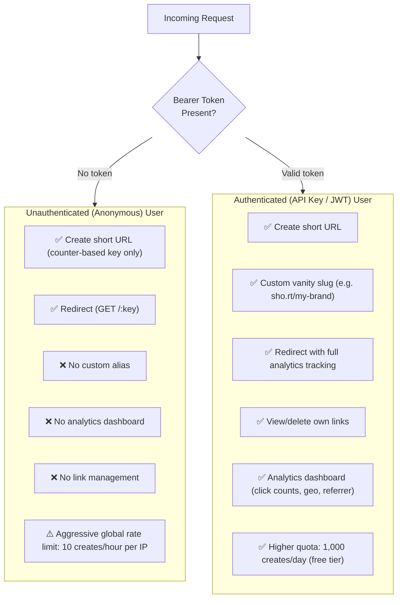

> **Why this matters architecturally:** The Write Service must extract user identity from the JWT on every write. Anonymous writes skip the user ownership table entirely. The Read Service remains **fully stateless and read-only regardless of auth level** — analytics events are always emitted to Kafka asynchronously, never inline.

### Design Principle: Read Service Immutability

> ✅ **Hard rule:** The **Read Service NEVER performs writes to any datastore** — not to ScyllaDB, not to Redis, not to any counter.
> - Click counts are emitted as Kafka events and processed by Flink consumers asynchronously.
> - Cache population is a side effect of the read-through pattern, not a deliberate write.
> - This guarantees the Read Service remains stateless, horizontally scalable, and independently deployable.

### Non-Functional Requirements

| # | Requirement | Target | Why |
|---|-------------|--------|-----|
| NFR1 | Redirect latency (p99) | < 50ms | UX — users notice redirect lag |
| NFR2 | Write latency (p99) | < 200ms | Background operation |
| NFR3 | Availability | 99.99% | 52 min downtime/year |
| NFR4 | Durability | 99.999% | Never lose a mapping |
| NFR5 | Short key uniqueness | Guaranteed | Collision = broken link |
| NFR6 | Scale | 500M writes/month, 50B reads/month | 100:1 ratio |

---

## 2. Back-of-the-Envelope Estimation

| Category | Figure | Notes |
|----------|--------|-------|
| **Reads/day** | 100 Billion | Given |
| **Read RPS (avg)** | ~1.15M RPS | 100B ÷ 86,400s |
| **Read RPS (peak 3×)** | ~3.5M RPS | Flash crowds, viral content |
| **Writes/day** | 1 Billion | 100:1 read/write ratio |
| **Write RPS (avg)** | ~11.5K RPS | 1B ÷ 86,400s |
| **Record size** | ~1 KB | URL + metadata + indexes |
| **Raw storage (5 yr)** | ~1.825 PB | 1B writes/day × 365 × 5 × 1 KB |
| **Total with replicas (3×)** | ~5.5 PB | ScyllaDB Replication Factor = 3 |
| **Short key length** | **8 chars Base62** | 218T keys = >500 yr runway |
| **Hot cache set (Zipf 20%)** | ~200M URLs | 20% of writes drive 80% of reads |
| **Redis L2 per datacenter** | ~512 GB | 260M hot URLs × 1 KB + overhead |
| **Bloom Filter (read-path)** | ~32 GB RAM | 26B keys × 10 bits, <1% false positive |
| **CDN-absorbed RPS** | ~920K RPS | 80% CDN hit rate |
| **Redis-absorbed RPS** | ~228K RPS | 99% hit of CDN misses |
| **ScyllaDB RPS** | ~2K RPS | 0.2% of total reads reach DB |

---

## 3. API Contract

### Shorten URL

```http
POST /v1/urls
Content-Type: application/json
Authorization: Bearer {api_key}

{
  "long_url":   "https://www.example.com/very/long/path?query=value",
  "custom_key": "my-sale",        // optional
  "ttl_days":   365               // optional, default 730
}
```

**Response 201 Created:**
```json
{
  "short_url":  "https://sho.rt/3DKusUKA",
  "short_key":  "3DKusUKA",
  "long_url":   "https://www.example.com/very/long/path?query=value",
  "expires_at": "2027-03-16T00:00:00Z",
  "created_at": "2026-03-16T10:00:00Z"
}
```

**Error responses:**
- `400` — malformed URL or invalid custom key characters  
- `409` — custom key already taken  
- `422` — shortened URL passed as input (circular reference prevention)  
- `429` — rate limit exceeded

### Redirect

```http
GET /{short_key}
```

**Response:**
- `302 Found` with `Location: {long_url}` header ← **preferred** (explained below)
- `404 Not Found` — key doesn't exist
- `410 Gone` — key existed but is expired

> **Why 302 (Found) not 301 (Moved Permanently)?**
>
> `301` is cached by browsers permanently — the redirect never hits your servers again.
> This breaks click analytics, A/B testing, and destination updates.
> `302` (temporary redirect) forces the browser to re-check every time, so every click is observable.
> Bit.ly uses `301` for their free tier and `302` for paid (analytics) tier — a deliberate product decision.

### Get Analytics

```http
GET /v1/urls/{short_key}/analytics?from=2026-01-01&to=2026-03-16&granularity=day
Authorization: Bearer {api_key}
```

### Delete / Expire URL

```http
DELETE /v1/urls/{short_key}
Authorization: Bearer {api_key}
```

---

## 4. High-Level Architecture

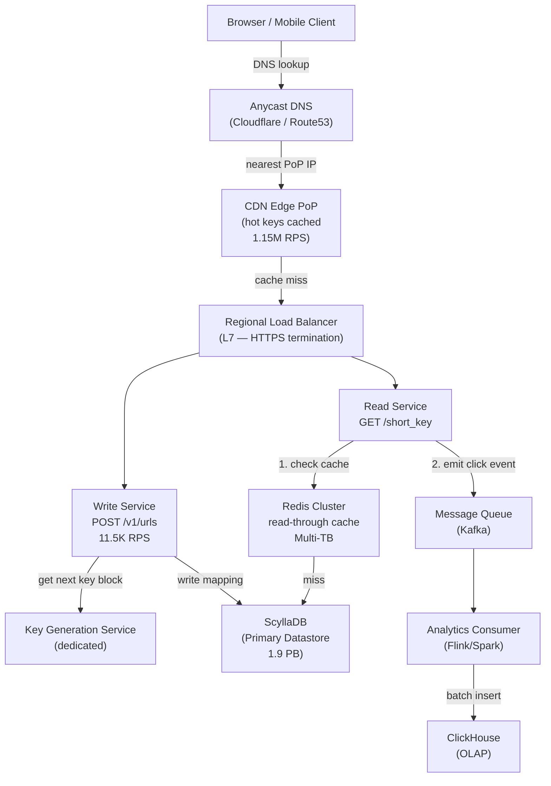

### Request flow — Write path

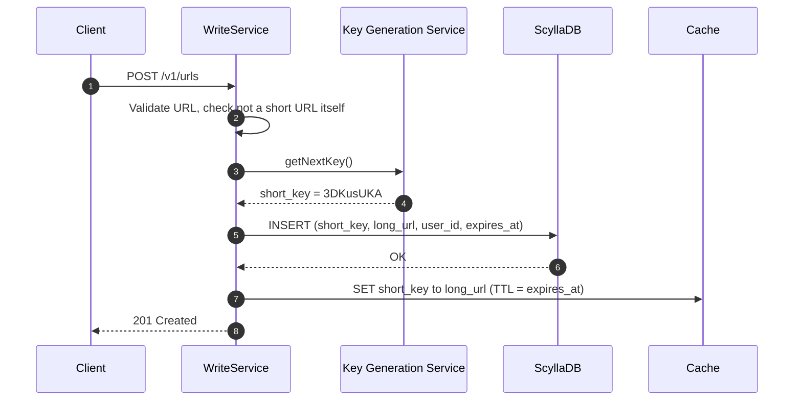

### Request flow — Read path (hot)

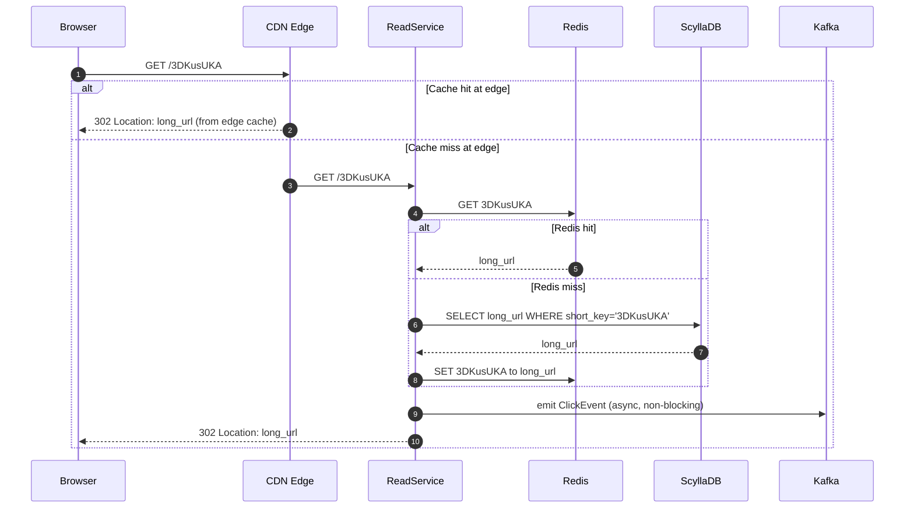

---

## 5. Deep Dive 1 — Key Generation

> The core algorithmic problem. There are two canonical approaches. Interviewers expect you to reason through the trade-offs, not just pick one.

### The Fundamental Tension

We need keys that are:
- **Unique** — no two URLs can have the same key
- **Short** — 8 characters maximum
- **Fast to generate** — must not be on the write critical path
- **Unpredictable** — cannot be enumerated by attackers

These goals conflict. Here's how each approach handles them:

---

### Approach A — Hash-Based (MD5 / SHA-256 + Base62)

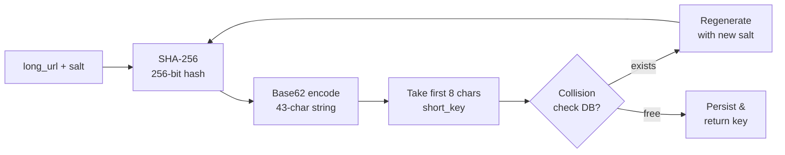

**Why SHA-256 + Base62, not MD5 + hex?**

| Property | MD5(128 bit) + hex | SHA-256(256 bit) + Base62 |
|----------|-----------|------------------|
| Output length | 32 hex chars | 43 Base62 chars |
| Collision resistance | Weak (MD5 broken) | Strong |
| Alphabet size | 16 | 62 |
| 8-char keyspace | 16^8 = 4.3B | 62^8 = 218T |

Note - 256 bits ÷ log₂(62) = 256 ÷ 5.954 ≈ 43 Base62 characters

Taking first 8 chars of a 43-char Base62 string is **not** the same as hashing to 8 chars — it preserves much more of the hash's entropy.

**The collision problem:**

```
P(collision after k insertions) ≈ k² / (2N)

With N = 62^8 = 218 trillion, k = 1.825 trillion (5-year writes):
P ≈ (1.825T)² / (2 × 218T)
  = 3.33 × 10^24 / 4.36 × 10^14
  ≈ 7.6 × 10^9  →  still effectively certain at this scale for hash-based
```

**Conclusion:** Hash-based approach requires collision detection via a DB round-trip on every write. At 200 writes/sec this is manageable, but the DB lookup adds ~5ms latency and creates a contention point.

---

### Approach B — Counter-Based with etcd Block Allocation ✅ Preferred

**Core insight:** Instead of generating a random key and checking for uniqueness, *pre-allocate exclusive numeric ranges* and convert them to Base62. Uniqueness is guaranteed by range exclusivity — no DB lookup needed at write time. At hyper-scale, we use a distributed consensus mechanism like **etcd** rather than a relational database to prevent locking bottlenecks.

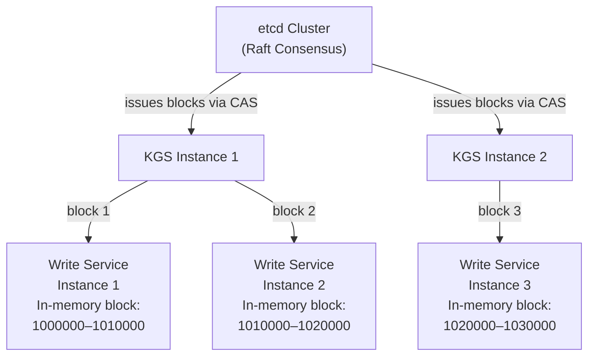

**How it works, step by step:**

1. **etcd Cluster:** A high-availability key-value store (used by Kubernetes) holds the `last_allocated_counter` key.
2. **KGS requests block:** uses a Compare-And-Swap (CAS) transaction to atomically reserve a large block (e.g., 10,000 keys) without race conditions.
3. **Write Service starts up:** Requests a block of 10,000 sequential integers from KGS.
   - Stores block in memory: `{start: 1000000, end: 1010000, current: 1000000}`
   - No remote call needed until the block is exhausted.
4. **Per request:** `current++` → convert to Base62 → this is the `short_key`.
5. **Block exhausted:** Request next block from KGS (async, pre-fetch when 80% used).

**Base-62 counter conversion:**

```
Decimal       →  Base62
56800235584   →  "10000000"  (8 chars, starting point)
56800235585   →  "10000001"
...
11316496598116  →  "3DKusUKA"
11316496598117  →  "3DKusUKB"
```

Key insight: monotonically increasing decimal integers map to monotonically increasing 8-char Base62 strings. We start at `10000000` (Base62) = ~56.8 billion decimal, giving us a clean 8-character range all the way to `ZZZZZZZZ` = 218 trillion.

**Preventing hotspot writes (monotonic key problem):**

A monotonically increasing primary key causes all DB writes to go to the *last page* of the B-tree index — a classic write hotspot.

Solutions (ranked by elegance):

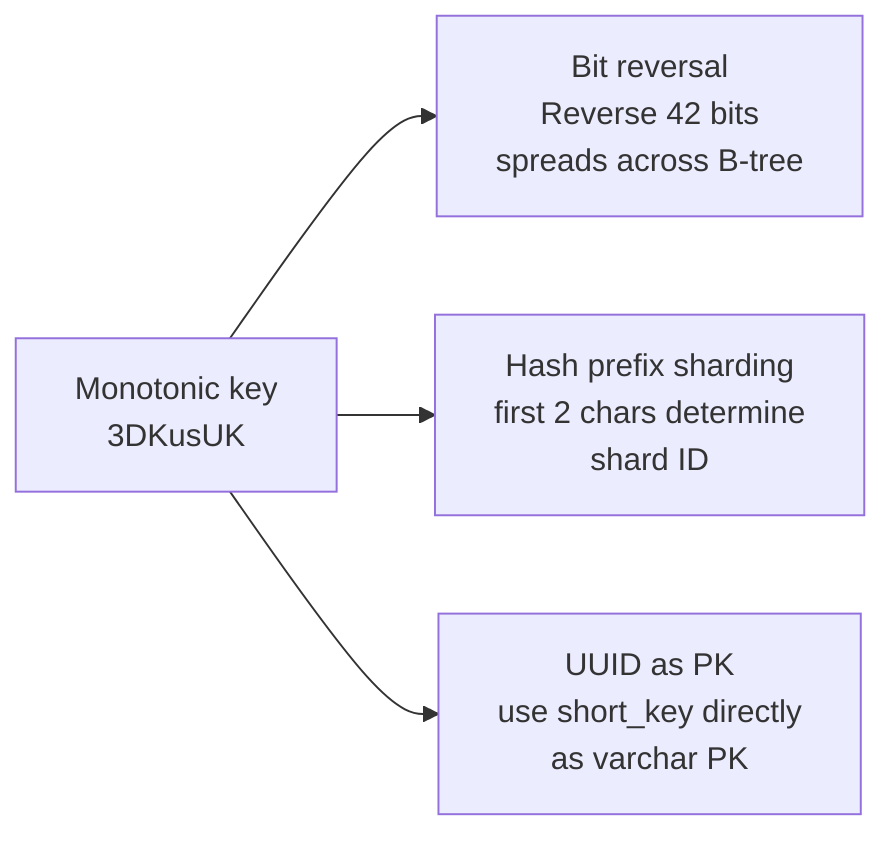

**Bit reversal** is the most CPU-efficient: flip the binary representation of the integer counter before storing as PK. Adjacent counters map to opposite ends of the keyspace → writes spread across the whole B-tree.

**Comparison table:**

| Property | Hash-Based | Counter-Based |
|----------|-----------|---------------|
| Uniqueness guarantee | Probabilistic (needs DB check) | Absolute (range exclusivity) |
| Write latency | +5ms (DB collision check) | O(1) in-memory |
| Key predictability | Unpredictable ✓ | Sequential (enumerate-able) ✗ |
| Custom key support | Natural | Needs separate alias table |
| Block waste on crash | None | ~10,000 keys (1 block) |
| Fault tolerance | DB replication | etcd (Raft cluster automatically heals) |

**Recommendation for interview:** Use Counter-Based as the primary design, Hash-Based for custom alias support (hybrid). Address key predictability by saying: "short keys are not secret — knowing `3DKusUL` exists doesn't give you the content of `3DKusUK`. If the content at the URL is sensitive, that's the origin server's problem (auth)."

---

### Custom Aliases — Hybrid Approach

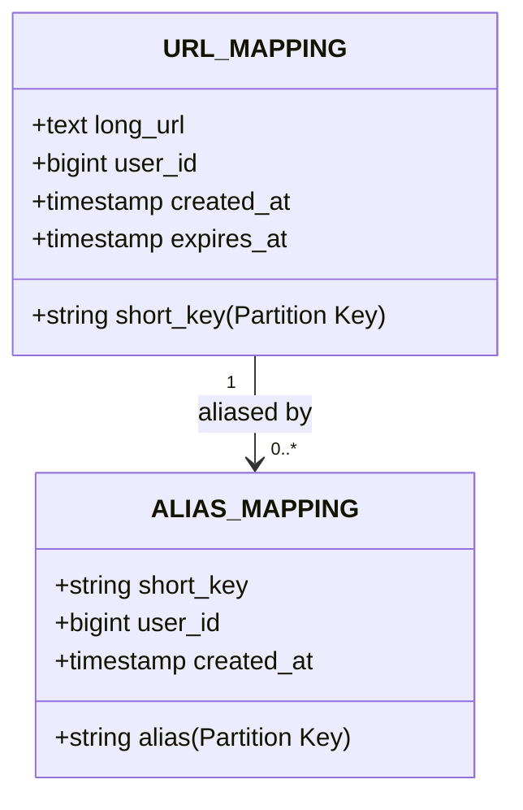

On lookup: check `ALIAS_MAPPING` first → resolve to `short_key` → lookup `URL_MAPPING`. Two reads, but alias lookups can be cached identically to regular keys.

---

## 6. Deep Dive 2 — Database Schema & Indexing

### Schema Design (ScyllaDB)

At 1.9 PB of data and 11.5K writes/sec, a traditional RDBMS like PostgreSQL introduces massive operational complexity (500+ shards, resharding pain, failover lag). A NoSQL Wide-Column store like **ScyllaDB** is the industry standard for this pattern.

```sql
-- Core mapping table
CREATE TABLE url_mapping (
    short_key     text,
    long_url      text,
    user_id       bigint,
    created_at    timestamp,
    expires_at    timestamp,
    is_active     boolean,

    PRIMARY KEY (short_key)
) WITH default_time_to_live = 63072000; -- 2 years default TTL

-- We use NoSQL TTL for auto-expiry. ScyllaDB elegantly drops rows via SSTable compaction.

-- Materialized View for user's URL management dashboard
-- (Assuming we restrict dashboard viewing to recent links to avoid huge partition scans)
CREATE MATERIALIZED VIEW url_mapping_by_user AS
    SELECT *
    FROM url_mapping
    WHERE user_id IS NOT NULL AND short_key IS NOT NULL
    PRIMARY KEY (user_id, created_at, short_key)
    WITH CLUSTERING ORDER BY (created_at DESC);

-- Custom alias table
CREATE TABLE alias_mapping (
    alias         text,
    short_key     text,
    user_id       bigint,
    created_at    timestamp,

    PRIMARY KEY (alias)
);
```

### Why these indexes and not others?

**PRIMARY KEY (short_key):** The redirect path is a pure partition key lookup (`O(1)` hash lookup) in ScyllaDB. Extremely fast and perfectly balanced.

**url_mapping_by_user:** Only needed for the "my links" dashboard. The `user_id` is the partition key, meaning all of a user's links live together on the same node, sorted by time.

**No index on long_url:** Deduplication requires read-before-write or a global secondary index on a TEXT column, which ruins the write path. The cost of storing two rows for the same URL is negligible (~1 KB).

### Sharding Strategy (NoSQL Ring)

With ScyllaDB, sharding is handled automatically via **Consistent Hashing** around a ring topology.

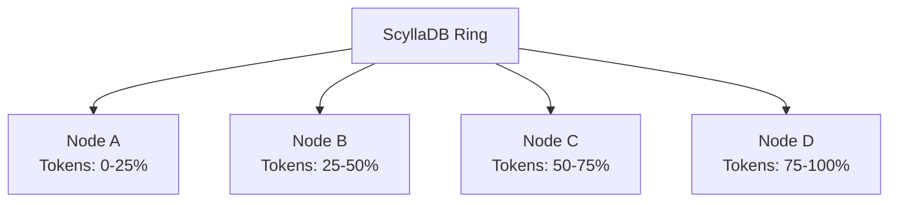

**Recommended:** `Replication Factor = 3`. Consistent hashing by `short_key` ensures perfectly even distribution over the 1.9 PB dataset. We just horizontally add nodes to the cluster linearly as storage scales without downtime.

## 5.5 Cache Strategy Deep Dive

### Tier Overview

| Tier | Technology | Location | TTL | Hit Rate Target | RPS Absorbed |
|------|-----------|----------|-----|----------------|--------------|
| **L1** | CDN Edge Cache (Cloudflare/Fastly) | ~300 PoPs globally | 1 hour | 80% | ~920K RPS |
| **L2** | Redis Cluster (Multi-TB) | Per datacenter | 24 hours | 99% of L1 misses | ~228K RPS |
| **L3** | ScyllaDB (source of truth) | Per datacenter | — | Fallback only | ~2K RPS |

> At L1+L2 combined, **ScyllaDB only sees ~0.2% of total read traffic** — 2,000 RPS out of 1.15M. This is why caching is the most critical performance lever in the system.

---

### Read Path — Read-Through with Bloom Filter Gate

On every redirect request, the Read Service follows this exact path:

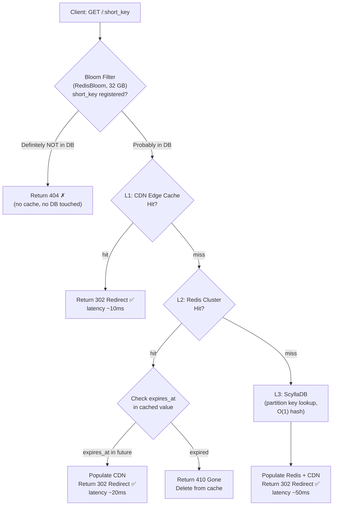

---

### Write Path — Cache-Aside (Lazy Population)

The write path uses **cache-aside** (not write-through). We do **not** populate Redis on write because:
- Short URLs are rarely read immediately after creation.
- Pre-populating all newly created entries would waste Redis memory on cold keys.
- Cache is populated on first read naturally.

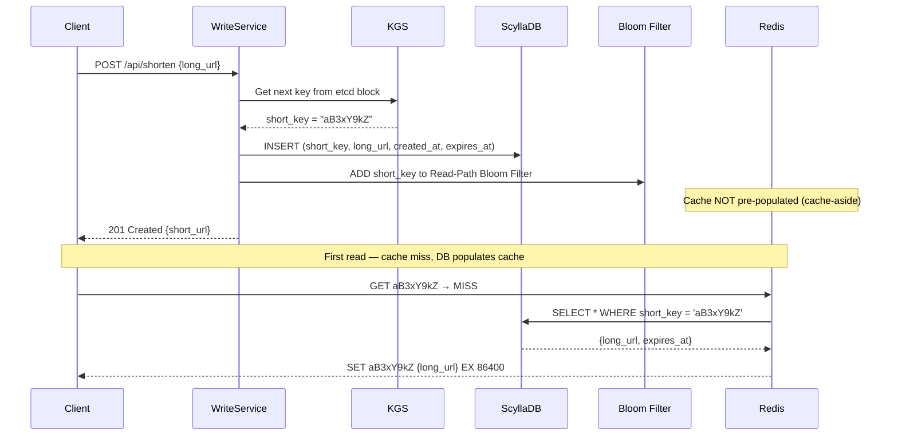

---

### URL Deletion & Cache Invalidation

When a URL is deleted or expires, we must proactively invalidate the cache — stale redirects are a phishing risk.

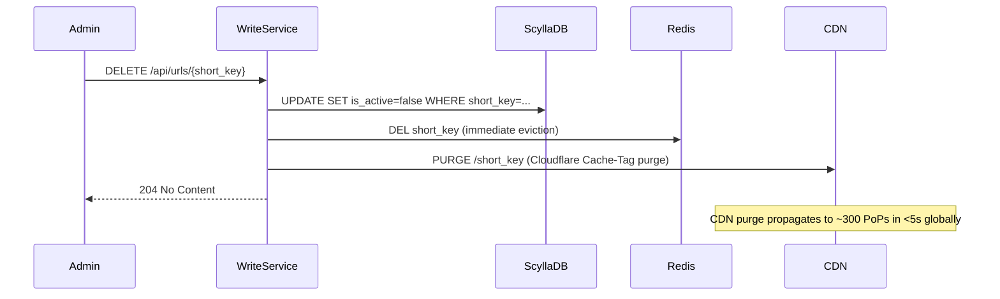

> **CDN purge strategy:** Tag every cached response with `Cache-Tag: short_key`. On delete, fire a single API call to Cloudflare's purge endpoint — all 300+ Edge PoPs invalidate within **< 5 seconds**. Faster than waiting for TTL expiry.

---

### TTL & Eviction Policy

| Key Type | L1 CDN TTL | L2 Redis TTL | Eviction Policy | Rationale |
|----------|-----------|-------------|-----------------|-----------|
| Active URL | 1 hour | 24 hours | LRU | Viral links stay hot; cold links evict naturally |
| Expired URL | Purge on delete | Purge on delete | — | Never serve a 302 to an expired URL |
| Non-existent key | Never cached | Never cached | Bloom Filter handles | No negative caching needed |
| User session | N/A | 30 minutes | LRU | Auth tokens, not URL data |

**Redis memory sizing (per datacenter):**
```
Hot dataset: top 1% of 26B URLs = 260M active URLs
260M × 1 KB per entry = ~260 GB per datacenter
With overhead: provision 512 GB Redis cluster (3× sharded Redis nodes, 170 GB each)
```

### Cache Read-Through Pattern Summary

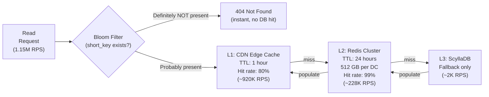

### Cache Security: Three Attack Vectors

At 1.15M RPS, the caching layer is the primary target for three distinct threat classes. We need a different mitigation for each.

| Attack | Vector | Tool | How it Works |
|--------|--------|------|--------------|
| **Cache Penetration** | Bots flood random/fake short keys that don't exist | Bloom Filter | Keys not in Bloom Filter get instant `404` — DB is never queried |
| **Cache Stampede** | Viral link TTL expires; millions hit DB simultaneously | XFetch | Probabilistic early refresh; one thread refreshes while others keep serving stale cache |
| **Malicious URL** | Users shorten phishing/malware links | Bloom Filter + Safe Browsing API | Write path checks URL against known-bad list before storing |

---

#### 1. Cache Penetration — Bloom Filter (Read Path)

**The Problem:** Attackers generate thousands of requests for random, non-existent short keys (e.g., `bit.ly/fake123`). These keys are not in the cache, so every request falls through to ScyllaDB. At scale, even 1% of 1.15M RPS = 11,500 RPS of pure garbage hitting the database.

**The Solution:** A **Bloom Filter** acts as the very first guard on every read request.

- When a new URL is shortened (write path), its `short_key` is added to the Bloom Filter.
- On every read, the Read Service queries the Bloom Filter **before** touching Redis or ScyllaDB.
- **Bloom Filter says "definitely not present"?** Instant `404`. No cache query. No DB query. ✅
- **Bloom Filter says "probably present"?** Proceed to L1 → L2 → L3 cache chain as normal.

> **Why not a Set/HashMap?** A Bloom Filter using `~10 bits/key` stores 26 Billion unique keys in ~32 GB of RAM — orders of magnitude cheaper than a hash set that would need TBs. The false positive rate (~1%) is acceptable: it just means we occasionally do an unnecessary cache lookup for a fake key, which will correctly miss and return `404` from the DB without data corruption.

```
Memory sizing: 26B keys × 10 bits/key = 260 Gb = ~32 GB RAM
False positive rate: <1% at 10 bits/entry
Implementation: Redis Bloom (RedisBloom module) — already on cluster, no new infra
```

---

#### 2. Cache Stampede — XFetch (Read Path)

**The Problem:** A viral URL (a Super Bowl ad, a breaking news link) generates millions of reads per minute. When its Redis TTL expires, the entire batch of in-flight requests simultaneously misses the cache and hits ScyllaDB — the **Thundering Herd** problem.

**The Solution: XFetch** (probabilistic early expiration). Rather than letting all threads miss simultaneously:

- As a cached entry approaches its TTL, each cache read thread calculates a small probability of acting as the "refresher thread" early.
- Only **one** thread triggers an async DB refresh before the TTL actually expires.
- All other threads continue serving the still-valid (but soon-to-expire) cached value.
- When the TTL finally hits, the new value is already in cache. Zero stampede.

```java
public String getShortUrlWithXFetch(String shortKey) {
    CacheEntry entry = redisCluster.get(shortKey);
    long now = System.currentTimeMillis();
    double random = new java.util.Random().nextDouble();

    // XFetch formula: the closer to expiry, the higher the probability of early refresh.
    // delta = time taken to recompute (fetch from DB), beta = tuning constant (default 1.0)
    if ((entry.getTtl() - now) < (XFETCH_BETA * entry.getComputationDelta() * Math.log(random))) {
        // One lucky thread refreshes asynchronously — all others keep serving stale cache
        CompletableFuture.runAsync(() -> refreshFromDatabase(shortKey));
    }
    return entry.getValue();
}
```

---

#### 3. Malicious URL — Bloom Filter (Write Path)

**The Problem:** Users shorten phishing or malware links. We must detect these on write, not read (so we never serve them).

**The Solution:** Separate Bloom Filter on the *write path* — loaded with the ~4 million known-bad domains from the **Google Safe Browsing API**.

- Write Service checks the incoming `long_url` domain against the Safe Browsing Bloom Filter.
- **Bloom Filter miss (definitely safe):** Store immediately.
- **Bloom Filter hit (probably bad):** Trigger a deep async scan against the full Safe Browsing API.
  - If confirmed malicious: reject write, return `400 Bad Request`.
  - If false positive: write proceeds normally after API confirmation.
- This keeps the write latency at ~0ms for the 99.99% legitimate case.

**Cache invalidation on expiry:**

Don't rely on TTL alone — use a lazy expiry check:
1. Cache stores `{long_url, expires_at}` as the value.
2. Read Service checks `expires_at` after cache hit.
3. If expired: return `410 Gone`, delete from cache, soft-delete in DB.
4. Background job cleans up DB records older than 30 days post-expiry.

---

## 7. Deep Dive 3 — Global Replication & Geo-Aware Routing

At hyper-scale (1.15M RPS), traffic must be served as close to the user as physically possible. Sending Tokyo traffic to a US-East server introduces 200ms+ round-trip latency, violating the `< 50ms` NFR redirect time. 

### CAP Theorem Position

For the **redirect path**, choose **AP (Availability + Partition Tolerance)**:
- A stale redirect (serving yesterday's destination) is better than a `503` error.
- Eventual consistency is perfectly acceptable.

For the **write path**, choose **CP (Consistency + Partition Tolerance)** at the Data Center level:
- Duplicate key issuance is catastrophic. KGS using etcd ensures CP locally.
- ScyllaDB uses `LOCAL_QUORUM` to ensure strong local consistency while asynchronously replicating globally.

### L4 / L7 Global Routing Flow

Traffic is shaped geographically using **Anycast DNS** and **Latency-Based Routing**:

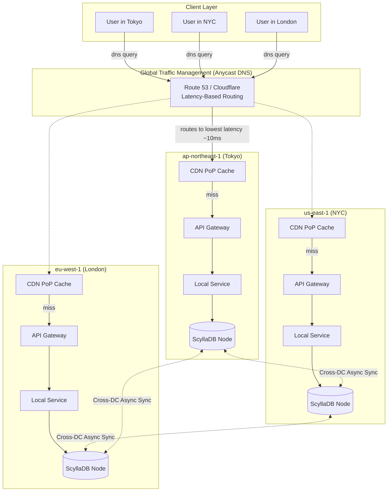

### Write Path — Multi-Active Geo-Writes

At 1 Billion writes/day, bottlenecking all global writes to a single primary region (`us-east-1`) introduces massive read-after-write latency globally. 

**Decision:** With ScyllaDB's multi-datacenter (Multi-DC) capabilities, we accept **strictly local writes** in every region safely. 
- Each region's KGS owns a unique block of the 8-character Base62 keyspace. 
- Because Key A uniquely originates in Region A, there are **never any write conflicts** across datacenters. We use Last-Write-Wins (LWW) resolution flawlessly in an Active-Active global setup.

### Database Layer Geo-Awareness (TokenAwarePolicy)

It is an anti-pattern to have a Local API Gateway reach out to a Local Datacenter ScyllaDB node, only to have that node forward the query to another node because it doesn't own the partition key. 

The application service (Java driver) must be explicitly configured with `TokenAwarePolicy` and `DCAwareRoundRobinPolicy`. This ensures the application routes its write/read strictly to the specific node in the local data center that physically owns the data replica, minimizing network hops.

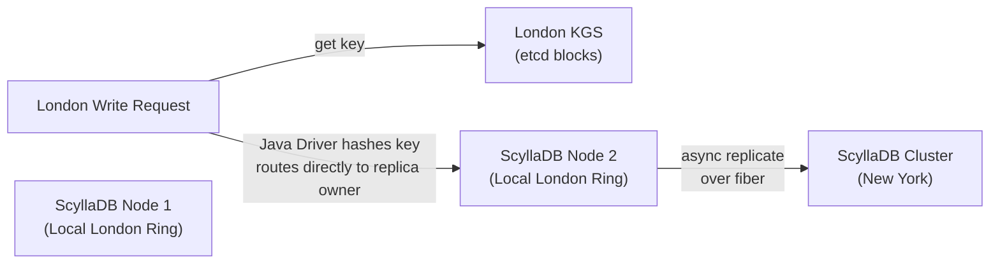

### Read Path — Local Reads

Reads never cross regions unless a localized catastrophe occurs. A user in Tokyo reads from the `ap-northeast-1` datacenter.

- **Replication lag risk:** A link created in London < 150ms ago might not be on the Tokyo replica yet.
- **Mitigation:** After creating a short link, the API response includes the short URL. The creator immediately clicking it hits their local datacenter (where it already exists via Local Quorum). Another user across the planet clicking it within 150 milliseconds is statistically impossible. 

### Consistency Levels (by operation type)

| Operation | Consistency | Reason |
|-----------|-------------|--------|
| Create short URL | Quorum | etcd CAS guarantees KGS uniqueness; ScyllaDB applies multi-DC quorum. |
| Redirect lookup | Eventual | Local ScyllaDB read; Stale redirect > 503 error |
| Delete / expire URL | Quorum | Need to propagate tombstones across DCs quickly |
| Read analytics | Eventual | Dashboard data can be seconds old |
| Custom alias write | Quorum | Strong consistency checking using ScyllaDB LWT (Lightweight Transactions) |

---

## 8. Deep Dive 4 — Analytics & Metrics Pipeline

### Why a separate analytics pipeline?

The redirect path must return a `302` in under 50ms. If analytics were synchronous (write to DB on every click), the click-tracking DB write would be on the critical path. At **1.15M RPS**, that's over a million writes per second to the analytics DB — any analytics DB latency spikes would completely cripple the user-visible redirect latency.

**Solution:** Emit a fire-and-forget **Kafka/Redpanda event** on every click. The redirect completes immediately; analytics processing is fully decoupled.

### Analytics Pipeline (1.15M Events/Sec)

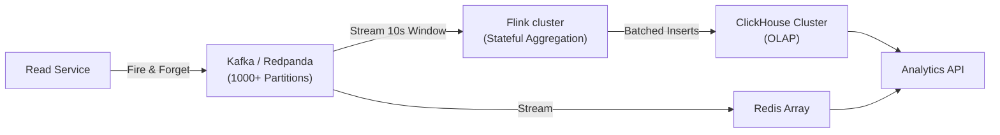

### Pipeline Architecture

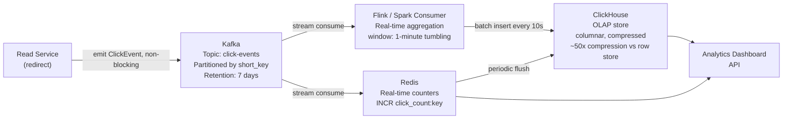

### Click Event Schema

```json
{
  "event_id":   "01HXYZ...",          // ULID — time-sortable, unique
  "short_key":  "3DKusUKA",
  "timestamp":  "2026-03-16T10:23:44.123Z",
  "ip_hash":    "sha256(ip + daily_salt)",  // never store raw IP (GDPR)
  "country":    "IN",                  // resolved from IP at edge
  "region":     "KA",
  "city":       "Bengaluru",
  "referrer":   "https://twitter.com",
  "user_agent": "Mozilla/5.0...",
  "device":     "mobile",              // parsed from user_agent
  "browser":    "Chrome/120",
  "os":         "Android/14"
}
```

### ClickHouse Schema (Columnar OLAP)

```sql
CREATE TABLE click_events (
    short_key   LowCardinality(String),   -- optimized for repeated values
    event_time  DateTime,
    country     LowCardinality(String),
    city        String,
    referrer    String,
    device      LowCardinality(String),
    browser     LowCardinality(String)
)
ENGINE = MergeTree()
PARTITION BY toYYYYMM(event_time)          -- monthly partitions for pruning
ORDER BY (short_key, event_time)           -- primary sort key
SETTINGS index_granularity = 8192;

-- Pre-aggregated materialized view for dashboard queries
CREATE MATERIALIZED VIEW click_hourly_mv
ENGINE = SummingMergeTree()
PARTITION BY toYYYYMM(hour)
ORDER BY (short_key, hour, country, device)
AS SELECT
    short_key,
    toStartOfHour(event_time) AS hour,
    country,
    device,
    count() AS clicks
FROM click_events
GROUP BY short_key, hour, country, device;
```

**Why ClickHouse over PostgreSQL for analytics?**

| Query | PostgreSQL (row) | ClickHouse (column) |
|-------|-----------------|---------------------|
| `SELECT count(*) WHERE short_key='3DK...'` | Scans full row (1KB each) | Reads only `short_key` column (14 bytes each) |
| Compression ratio | ~2x | ~50x (columnar delta encoding) |
| Aggregation speed (1B rows) | Minutes | Seconds |
| Write throughput | ~50K rows/sec | ~1M rows/sec (batch) |

### Real-time Counters vs Batch Analytics

Two different data paths for two different use cases:

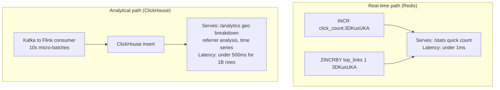

**GDPR / Privacy note** (mention this — Meta cares deeply):
- Never store raw IP addresses. Hash with a daily-rotating salt: `sha256(ip + date_salt)`.
- This allows "unique visitor" counting within a day without persistent tracking.
- Country/city resolution happens at the CDN edge (Cloudflare Workers) before the IP leaves the PoP — raw IP never reaches your origin.

---

## 9. Failure Modes & Edge Cases

### Failure Mode Matrix

| Failure | Impact | Detection | Mitigation |
|---------|--------|-----------|------------|
| Write Service crash | New URL creation fails | Health check + LB drain | Stateless — restart, KGS block returned |
| Read Service crash | Redirects fail | Health check, 99.99% SLA alert | Stateless — restart immediately |
| KGS crash | Write Service can't get new blocks | Write Service timeout | Dual KGS (odd/even), circuit breaker falls back |
| Redis crash | Every read hits DB | Redis sentinel / cluster health | DB read replicas absorb load; Redis auto-restart |
| Primary DB crash | Writes fail | DB Latency Alert | Active-Active ScyllaDB implies no single primary — writes reroute to another node |
| Kafka lag spike | Analytics delayed | Consumer lag metric > 10M events | Scale consumers, shed non-critical metrics |
| CDN cache poisoning | Stale or wrong redirects served | Anomaly detection on 302 count drop | Short CDN TTL (1hr), purge API on URL update |

### Rate Limiting — Envoy Two-Tier Architecture

A single Redis-backed token bucket is a common starting point, but at 1.15M RPS it creates a bottleneck: **every request pays a Redis round-trip (~1ms)** just to check its quota. Envoy solves this with two complementary rate-limiting tiers.

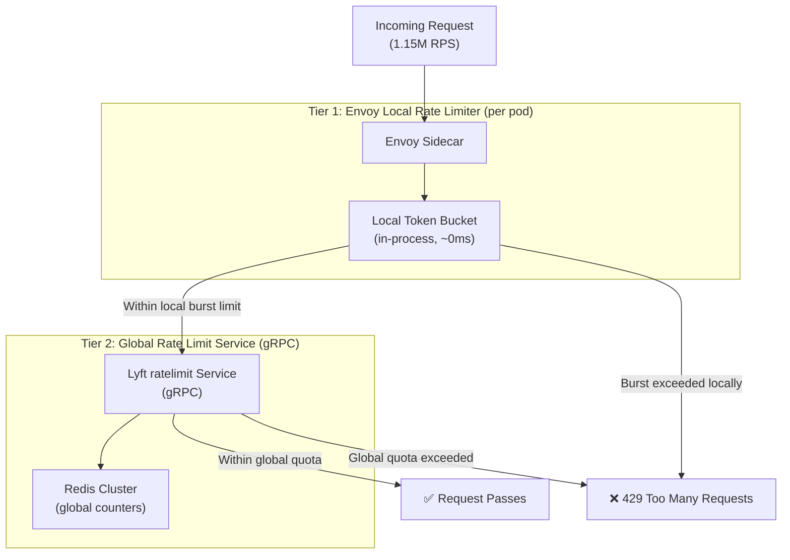

#### Tier 1 — Envoy Local Rate Limiter

- Runs **in-process inside the Envoy sidecar** (no network call).
- Uses a **per-pod token bucket** to absorb short request bursts.
- Protects each pod from being immediately overwhelmed.
- Latency cost: **~0ms** — pure in-memory arithmetic.
- Config: e.g. `max_tokens: 10,000`, `tokens_per_fill: 1,000/sec` per pod.

> ⚠️ **Interview note:** Local limits are per-instance, so technically a single user could hit `N pods × local_limit`. This is intentional — we use local limits only for burst smoothing, not for exact quota enforcement.

#### Tier 2 — Global Rate Limit Service (Envoy + Lyft ratelimit)

- For **exact per-user / per-API-key quotas** (e.g., free tier: 100 URL creates/day), we need a globally consistent counter.
- Envoy calls the **Lyft `ratelimit` gRPC service** (open source, battle-tested at Lyft, DoorDash) for cross-pod enforcement.
- The ratelimit service is backed by Redis using atomic `INCR` + `EXPIRE` for sliding window counters.
- Latency cost: **~1ms** (local Redis call, same datacenter).

#### Rate Limit Dimensions We Enforce

| Dimension | Limit | Tier | Rationale |
|-----------|-------|------|-----------|
| Per IP — burst | 100 req/sec | Local (Tier 1) | Bot flood protection |
| Per API key — creates | 1,000/day free | Global (Tier 2) | Business quota |
| Per API key — redirects | Unlimited read | None | Reads are CDN-cached anyway |
| Per user — custom aliases | 50/day | Global (Tier 2) | Custom alias DB is expensive |
| Global — write path | 15K writes/sec | Local (Tier 1) | Protect KGS block allocation |

#### Integration with Existing Architecture

Envoy runs as a **sidecar** in every Write Service and Read Service Kubernetes pod. No application-level rate limiting code is needed — the enforcement is entirely at the network layer, giving you zero-code quota updates via config reload.

### Edge Cases

**Circular redirect prevention (Java):**
```java
import java.net.URI;
import java.net.URISyntaxException;

public boolean validateUrl(String inputUrl) {
    try {
        URI uri = new URI(inputUrl);
        String host = uri.getHost();
        
        // Reject if hostname matches our own domain to prevent circular redirects
        // Requires comparing against root domain and all active subdomains
        if (host != null && OUR_DOMAINS.contains(host)) {
            throw new CircularRedirectException("Cannot shorten a short URL");
        }
        return true;
    } catch (URISyntaxException e) {
        throw new InvalidUrlException("Malformed URL provided");
    }
}
```

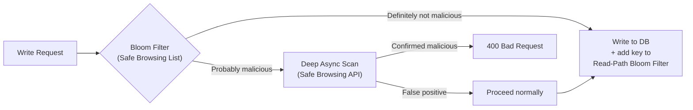

**Malicious URL detection:** Check `long_url` against a Bloom Filter pre-loaded with the Google Safe Browsing dataset on write. If flagged and confirmed, set `is_active = false` and serve a warning interstitial instead of redirecting. See **Cache Security: Three Attack Vectors** in the Caching section for full details.

**Custom key conflicts with counter range:**
```
Counter key space: "10000000" to "ZZZZZZZZ" (all 8-char Base62)
Custom keys: stored in alias_mapping table — separate namespace
No collision possible by design
```

**Same long URL, multiple short keys:**
This is fine and by design. Counter-based approach generates a new key per request. Benefits:
- Each key independently trackable.
- One key can be shared with group A, another with group B for A/B testing.
- Removing one key doesn't affect others.

**Expired key reuse:**
Do NOT reuse expired keys. A web crawler or user's bookmarks may have cached the old mapping. Serving a different URL under the same key is confusing and potentially a phishing vector. Keys are retired permanently.

---

### The 3 Questions

**1. "Why 302 not 301?"**
> "301 is permanently cached by the browser — the redirect never hits our servers again, breaking all analytics. We need 302 because indirection is the whole value proposition — every click must be observable. I'd only use 301 if we had a 'performance mode' where analytics don't matter and we want CDN-level caching."

**2. "What's your biggest bottleneck at hyper-scale (1M+ RPS)?"**
> "The caching and Edge layers are the real bottlenecks. At 1.15M RPS, we must rely heavily on CDN Edge PoPs buffering viral links. The L2 Redis clusters need to be massively scaled out into a tiering approach (TB-scale memory). For the DB, pushing 12K writes/sec requires abandoning RDBMS like PostgreSQL in favor of a horizontally partitioned Wide-Column store like ScyllaDB operating in Active-Active across global data centers."

**3. "How do you handle a region going down?"**
> "For reads: CDN and Redis serve from local cache, while misses re-route to surviving KGS/DB regions. For writes: We employ Active-Active ScyllaDB instances globally. If `us-east-1` drops, Route53 instantly redirects incoming traffic to `eu-west-1` or `ap-south-1`. Those local Write Services simply talk to their local KGS (for unique keys) and their local ScyllaDB nodes, with background replication synchronizing data once `us-east-1` comes back."

### Trade-offs to Proactively Volunteer

These show depth — mention them before the interviewer asks:

| Trade-off | Your position |
|-----------|---------------|
| 7 VS 8 char keyspace | 8 characters is absolutely required for 1 Billion daily writes to ensure a 500-year algorithmic run-time. |
| Relational vs NoSQL DB | ScyllaDB (Consistent Hashing) is required for 1.9 PB scale vs single-writer Sharded Postgres. |
| Hash-based vs counter-based keys | Counter-based for performance; hash-based for custom alias support (hybrid) |
| Active-Passive DB vs Active-Active | Active-Active Multi-DC NoSQL is much better suited to remove single points of failure at 1M+ RPS. |
| 302 vs 301 | 302 always unless analytics are explicitly not needed |
| Strong vs eventual consistency | Strong for writes (key uniqueness), eventual for reads (availability) |
| ClickHouse vs PostgreSQL for analytics | ClickHouse for columnar OLAP; never share write DB with analytics |
| CDN TTL length | Short (1hr) to preserve analytics accuracy; longer only for static/never-expiring links |
| Sync vs async analytics | Always async — never on redirect critical path |

### Anti-Patterns to Avoid Saying

- ❌ "We'll use a UUID as the short key" — UUIDs are 36 chars; not short.
- ❌ "We'll just check the DB for collision on every write" — works at low scale, fails at 200 writes/sec under high collision probability.
- ❌ "We'll store analytics in the same PostgreSQL database" — mixing OLTP and OLAP on the same DB is a classic mistake.
- ❌ "We'll use 301 for performance" — breaks analytics without explaining the trade-off.
- ❌ "We'll have a global single load balancer" — single point of failure + all global traffic pays latency to reach it.

---

## 11. Monitoring, Alerting & SLO Definitions

At 1.15M RPS across 3 global regions, you need observable, actionable signals — not just logs.

### SLO Targets

| SLO | Target | Alert Threshold |
|-----|--------|----------------|
| Redirect p99 latency | < 50ms | Alert if > 40ms for > 2 min |
| Redirect p999 latency | < 200ms | Page if > 150ms for > 1 min |
| Redirect error rate | < 0.01% | Alert if > 0.005% |
| Write p99 latency | < 200ms | Alert if > 150ms |
| Availability | 99.99% (monthly) | Page immediately on datacenter outage |
| Redis hit rate | > 90% | Alert if drops below 90% |

### Key Metrics

```mermaid
graph TD
    subgraph "Read Path"
        R1["redirect_latency_p99 (per region)"]
        R2["cache_hit_rate_l1 (CDN)"]
        R3["cache_hit_rate_l2 (Redis)"]
        R4["bloom_filter_reject_rate"]
    end
    subgraph "Write Path"
        W1["url_create_latency_p99"]
        W2["kgs_block_fill_rate"]
        W3["write_error_rate"]
    end
    subgraph "Infrastructure"
        I1["kafka_consumer_lag"]
        I2["scylladb_read_latency"]
        I3["redis_memory_used_pct"]
        I4["etcd_leader_election_count"]
    end
```

### Alerting Playbook

| Alert | Severity | Immediate Action |
|-------|----------|-----------------|
| Redis hit rate < 90% | P2 | Check eviction pressure; scale Redis cluster |
| Kafka lag > 10M events | P2 | Scale Flink consumers; check for crashes |
| KGS block fill > 80% in < 1s | P1 | Scale KGS + check etcd |
| `etcd_leader_election_count` > 0 | P1 | etcd instability; check network partitions |
| p99 latency > 40ms | P2 | Check CDN hit rate + Redis health first |
| Any datacenter health check fail | P0 | Trigger regional failover via Route53 |

---

## 12. Pod Cold Start & Read Service Warm-Up

### The Problem

When the auto-scaler adds a new Read Service pod during a surge event, its **caches are cold**. Every request misses L2 Redis and lands directly on ScyllaDB until warm-up completes. At 1.15M RPS, 50 new pods simultaneously = 50 × N ScyllaDB-miss requests.

### Warm-Up Strategies

```mermaid
flowchart TD
    SURGE["Auto-scaler adds new pod"]

    subgraph "Strategy A: Consistent Hash LB"
        LB1["Route by hash(short_key) % N pods"]
        WARM1["Same pod always handles same key → stays warm"]
        CONS1["⚠️ Con: Uneven load on hot key spikes"]
    end

    subgraph "Strategy B: Kafka Hot-Key Replay (Recommended)"
        KAFKA["Read last 10 min of Kafka click events"]
        TOP["Extract top 10K clicked short_keys"]
        PRE["Pre-warm Redis entries before joining LB pool"]
        CONS2["✅ Pod pre-warms in ~30s before receiving traffic"]
    end

    subgraph "Strategy C: Redis-only (No in-process cache)"
        REDIS["Skip in-process L0 cache; rely on Redis (~1ms)"]
        CONS3["✅ Always warm  ⚠️ Con: Every request pays Redis RTT"]
    end

    SURGE --> LB1
    SURGE --> KAFKA
    SURGE --> REDIS
```

**Recommended: Strategy B** — New pod marks itself `WARMING`, replays top 10K keys from Kafka, then marks `READY` and joins the load balancer pool. Total: **~15–30 seconds**.

> **Bloom Filter warm-up:** The Read-Path Bloom Filter must also be seeded on pod startup from a Redis snapshot or Kafka compacted topic log before the pod can serve requests accurately.

---

## 13. Data Retention, GDPR & Right to be Forgotten

### The Problem

URLs frequently contain **PII in query parameters**:
```
https://example.com/signup?email=user@company.com&referral=abc123
```
Under **GDPR Article 17** and **CCPA**, a soft-delete (`is_active = false`) is insufficient. PII must be **hard deleted** across all systems.

### Hard Delete Cascade

```mermaid
sequenceDiagram
    participant User
    participant WriteService
    participant ScyllaDB
    participant Redis
    participant CDN
    participant Kafka
    participant ClickHouse

    User->>WriteService: DELETE /v1/urls/{short_key} (GDPR flag)
    WriteService->>ScyllaDB: DELETE row (tombstone replicates globally)
    WriteService->>Redis: DEL short_key
    WriteService->>CDN: Purge Cache-Tag (propagates to 300+ PoPs in <5s)
    WriteService->>Kafka: Emit GDPR_ERASURE {short_key, user_id}
    Kafka->>ClickHouse: Consumer: DELETE analytics WHERE short_key = '...'
    WriteService-->>User: 204 No Content (async cleanup continues)
```

### Data Retention Policy

| Store | Retention | Deletion Mechanism |
|-------|-----------|--------------------|
| ScyllaDB | Link TTL (max 2 years) | ScyllaDB TTL SSTable compaction |
| Redis | 24h TTL or explicit `DEL` | `DEL key` on deletion event |
| CDN | 1h TTL + explicit purge on delete | Cloudflare Cache-Tag purge |
| Kafka (click events) | 7 days rolling | Topic retention policy |
| ClickHouse (analytics) | 90 days rolling | Background cleanup job |

### URL PII Scrubbing (Analytics Pipeline)

Before emitting click events to Kafka, scrub known PII fields from the stored `long_url`:

```java
public String scrubPiiFromUrl(String longUrl) throws URISyntaxException {
    List<String> PII_PARAMS = List.of("email", "name", "phone", "user_id", "token");
    URI uri = new URI(longUrl);
    if (uri.getQuery() == null) return longUrl;

    String sanitized = Arrays.stream(uri.getQuery().split("&"))
        .filter(p -> PII_PARAMS.stream().noneMatch(pii -> p.startsWith(pii + "=")))
        .collect(Collectors.joining("&"));

    return new URI(uri.getScheme(), uri.getAuthority(),
                   uri.getPath(), sanitized, uri.getFragment()).toString();
}
```

---